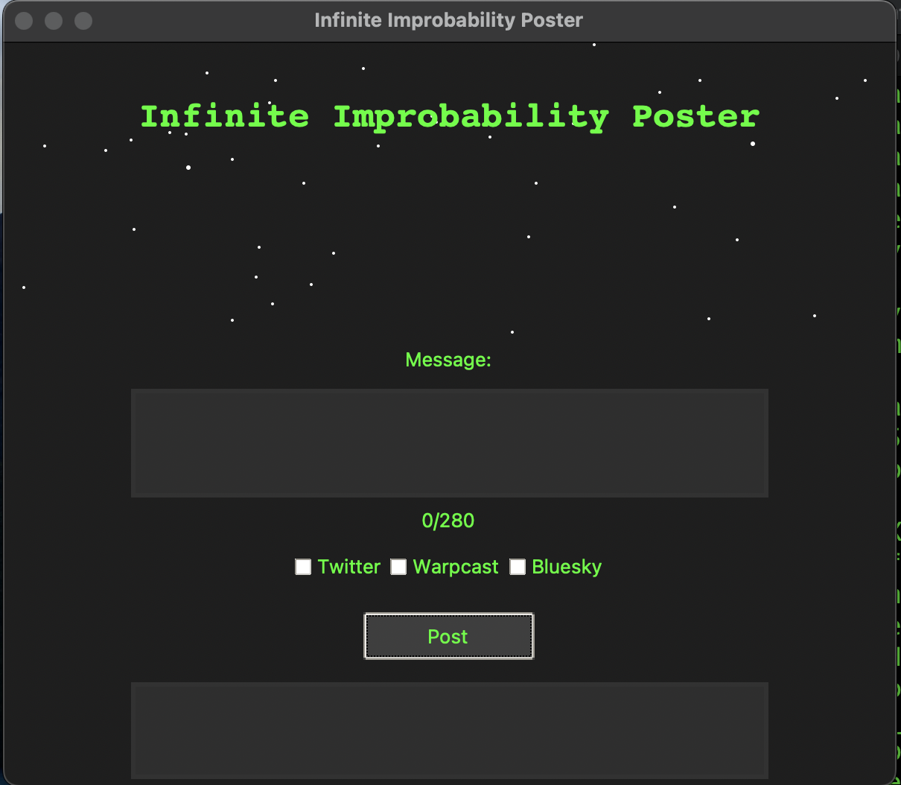

# Infinite Improbability Poster

Infinite Improbability Poster is a Python-based desktop application that allows you to post messages to Twitter and Warpcast simultaneously. Inspired by Douglas Adams' "The Hitchhiker's Guide to the Galaxy", this app brings a touch of sci-fi whimsy to your social media posting experience.



## Features

- [x] Stylish sci-fi themed GUI with starfield background
- [x] Post messages to Twitter and Warpcast simultaneously
- [x] Character count display (280 character limit)
- [ ] Image attachment support
- [ ] Real-time status updates
- [ ] Scheduled posting
- [ ] Draft saving
- [ ] Multiple account support

## Requirements

- Python 3.7+
- Tkinter (usually comes pre-installed with Python)
- Tweepy
- Warpcast Python SDK

## Setup

1. Clone the repository:
   ```
   git clone https://github.com/BitsofJeremy/infinite_improbability_poster.git
   cd infinite_improbability_poster
   ```

2. Create a virtual environment (optional but recommended):
   ```
   python -m venv venv
   source venv/bin/activate  # On Windows, use `venv\Scripts\activate`
   ```

3. Install the required packages:
   ```
   pip install -r requirements.txt
   ```

4. Set up your environment variables:
   Create a `.env` file in the project root directory and add your API keys:
   ```
   CONSUMER_KEY=your_twitter_consumer_key
   CONSUMER_SECRET=your_twitter_consumer_secret
   OAUTH_TOKEN=your_twitter_oauth_token
   OAUTH_TOKEN_SECRET=your_twitter_oauth_token_secret
   MNEMONIC_ENV_VAR=your_warpcast_mnemonic
   ```

## How to Run

1. Ensure you're in the project directory and your virtual environment is activated (if you're using one).

2. Run the main script:
   ```
   python infinite_improbability_poster.py
   ```

3. The Infinite Improbability Poster GUI should appear. You can now compose your message, select which platforms to post to, and click "Post" to send your message across the galaxy (or at least to Twitter and Warpcast).

## Usage

1. Enter your message in the text box. The character count will update as you type.
2. Check the boxes for the platforms you want to post to (Twitter and/or Warpcast).
3. (NOT WORKING YET!) Click "Add Image" to attach an image to your post.
4. Click "Post" to send your message.
5. The status of your post will appear in the output box at the bottom of the window.

## Contributing

Contributions are welcome! Please feel free to submit a Pull Request.

## License

This project is licensed under the GNU AFFERO GENERAL PUBLIC LICENSE - see the [LICENSE](LICENSE) file for details.

## Acknowledgments

- Douglas Adams for the inspiration
- The Tweepy and Warpcast SDK developers for making Twitter and Warpcast integration possible
- All the contributors to this project

## Contact

If you have any questions, feel free to reach out to me on Twitter or Warpcast.

May your posts always find their way through the infinite improbability of the internet!
